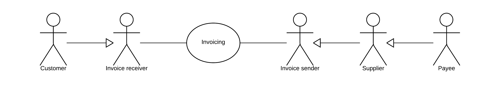
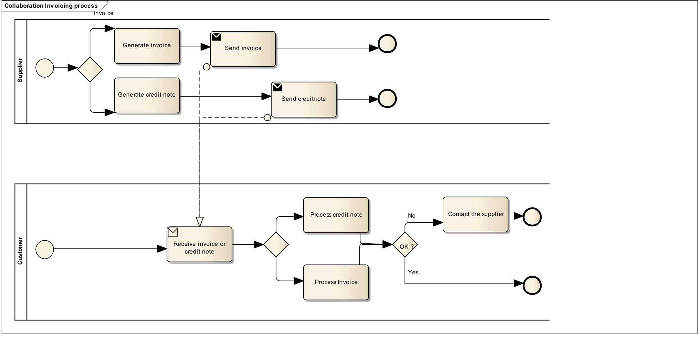

= 1. Business Processes

TW-PINT follows the PINT billing process for issuing an invoice or credit note from a seller to a buyer through Peppol-compatible exchange. Taiwan-specific handling is limited to local identifiers, tax terms, eGUI bridge references, and validation constraints.

== 1.1. Parties and roles

The diagram below shows the roles involved in the invoice and credit note transactions. The customer and invoice receiver is the same entity, as is the supplier and the invoice sender.
TW-PINT follows the PINT billing process: seller creates invoice data, the invoice is represented as UBL 2.1, the sender validates UBL, PINT shared rules and TW-PINT rules, the invoice is exchanged through Peppol, and the receiver validates and processes the invoice.

=== 1.1.1. Parties
*Customer*
The customer is the legal person or organisation who is in demand of a product or service. Examples of customer roles: buyer, consignee, debtor, contracting authority.
*Supplier*
The supplier is the legal person or organisation who provides a product or service.
=== 1.1.2. Roles
Roles in TW-PINT are aligned with PINT. The seller prepares the invoice or credit note; the buyer receives and processes it; optional roles such as payee or tax representative are used only when the underlying commercial process requires them. Taiwan-specific identifiers should be applied to existing party structures rather than creating new parties.
*Creditor*
One to whom a debt is owed. The party that claims the payment and is responsible for resolving billing issues and arranging settlement. The party that sends the invoice or credit note. Also known as invoice issuer, accounts receivable or seller.
*Debtor*
One who owes debt. The party responsible for making settlement relating to a purchase. The party that receives the invoice or credit note. Also known as invoicee, accounts payable, or buyer.

== 1.2. PINT Billing process
The invoicing process includes issuing and sending the invoice and the credit note from the supplier to the customer and the reception and handling of the same at the customer’s site.
The invoicing process is shown in this workflow:
* A supplier issues and sends an invoice to a customer. The invoice refers to one order and a specification of delivered goods and services.
An invoice may also refer to a contract or a frame agreement. The invoice may specify articles (goods and services) with article number or article description.
* The customer receives the invoice and processes it in the invoice control system leading to one of the following results:
.. The customer fully approves the invoice, posts it in the accounting system and passes it on to be paid.
.. The customer completely rejects the invoice, contacts the supplier and requests a credit note.
.. The customer disputes parts of the invoice, contacts the supplier and requests a credit note and a new invoice.
The diagram below shows the basic invoicing process with the use of this Peppol BIS profile. This process assumes that both the invoice and the credit note are exchanged electronically.

*	This profile covers the following invoice processes:
P1	Invoicing of deliveries of goods and services against purchase orders, based on a contract
P2	Invoicing deliveries of goods and services based on a contract
P3	Invoicing the delivery of an incidental purchase order
P4	Pre-payment
P5	Spot payment
P6	Payment in advance of delivery
P7	Invoices with references to a despatch advice
P8	Invoices with references to a despatch advice and a receiving advice
P9	Credit notes or invoices with negative amounts, issued for a variety of reasons including the return of empty packaging
*	The seller creates an invoice or credit note using UBL 2.1 and the TW-PINT CustomizationID.
*	The sender validates the document against UBL syntax, PINT/BIS rules, and TW-PINT aligned rules.
*	The Peppol sender Access Point transmits the document using standard Peppol transport.
*	The receiver validates and processes the document. If the receiver is connected to Taiwan eGUI processing, a gateway maps the document to the required eGUI process.
*	Any eGUI document number, upload status, or local archival process remains outside Peppol routing and does not change the core invoice semantics.

== 1.3. Invoice functionality

An invoice may support functions related to a number of related (internal) business processes. This Peppol BIS shall support the following functions:
*	Accounting
*	Invoice verification against the contract, the purchase order and the goods and service delivered
*	Tax reporting
*	Auditing
*	Payment
In the following chapters an assessment is made of what information is needed for each of the functions listed above and whether it is in scope or out of scope for this Peppol BIS.
Explicit support for the following functions (but not limited to) is out of scope:
*	Inventory management
*	Delivery processes
*	Customs clearance
*	Marketing
*	Reporting

=== 1.3.1. Accounting

Recording a business transaction into the financial accounts of an organization is one of the main objectives of the invoice. According to financial accounting best practice and TAX rules every Taxable person shall keep accounts in sufficient detail for TAX to be applied and its application checked by the tax authorities. For that reason, an invoice shall provide for the information at document and line level that enables booking on both the debit and the credit side.

=== 1.3.2. Invoice verification

This process forms part of the Buyer’s internal business controls. The invoice shall refer to an authentic commercial transaction. Support for invoice verification is a key function of an invoice. The invoice should provide sufficient information to look up relevant existing documentation, electronic or paper, for example, and as applicable:
*	the relevant purchase order
*	the contract
*	the call for tenders, that was the basis for the contract
*	the Buyer’s reference
*	the confirmed receipt of the goods or services
*	delivery information
An invoice should also contain sufficient information that allows the received invoice to be transferred to a responsible authority, person or department, for verification and approval.

=== 1.3.3. Auditing

Companies audit themselves as means of internal control or they may be audited by external parties as part of a legal obligation. Accounting is a regular, ongoing process whereas an audit is a separate review process to ensure that the accounting has been carried out correctly. The auditing process places certain information requirements on an invoice. These requirements are mainly related to enable verification of authenticity and integrity of the accounting transaction.
Invoices, conformant to this PEPPOL BIS support the auditing process by providing sufficient information for:
*	identification of the relevant Buyer and Seller
*	identification of the products and services traded, including description, value and quantity
*	information for connecting the invoice to its payment
*	information for connecting the invoice to relevant documents such as a contract and a purchase order

=== 1.3.4. Tax Reporting

The invoice is used to carry Tax related information from the Seller to the Buyer to enable the Buyer and Seller to correctly handle Tax booking and reporting. An invoice should contain sufficient information to enable the Buyer and any auditor to determine whether the invoice is correct from a Tax point of view.
The invoice shall allow the determination of the Tax regime, the calculation and description of the tax, in accordance with the relevant legislation.

=== 1.3.5. Payment

An invoice represents a claim for payment. The issuance of an invoice may take place either before or after the payment is carried out. When an invoice is issued before payment it represents a request to the Buyer to pay, in which case the invoice commonly contains information that enables the Buyer, in the role of a debtor, to correctly initiate the transfer of the payment, unless that information is already agreed in prior contracts or by means of payment instructions separately lodged with the Buyer.
If an invoice is issued after payment, such as when the order process included payment instructions or when paying with a credit card, online or telephonic purchases, the invoice may contain information about the payment made in order to facilitate invoice to payment reconciliation on the Buyer side. An invoice may be partially paid before issuing such as when a pre-payment is made to confirm an order.
Invoices, conformant with this specification should identify the means of payment for settlement of the invoice and clearly state what payment amount is requested. They should provide necessary details to support bank transfers. Payments by means of Credit Transfer, Direct debit, and Payment Card are in scope.

== 1.4. Credit notes and negative invoices

Reverting an invoice that has been issued and received can be done in two basic ways. Either by issuing a credit note or a negative invoice.
When crediting by means of a credit note, the document type code is '381' (or its synonym), and the credit note quantities and extension/total amounts have the same sign (plus or minus) as the invoice that is being cancelled/credited. The document type code acts as an indicator that the given amounts are booked in reverse and cancel out the invoice amounts.
When crediting by means of a negative invoice, the document type code is '380' (or its synonym), and the negative invoice quantities and extension/total amounts have the opposite sign (minus vs plus) as the invoice being cancelled/credited. It is the mathematical sign that indicates that when the amounts are booked they cancel out the original amounts. The Price Amount must always be positive.
A credit note may include negative amounts when cancelling an invoice that may have negative line items/amounts.
TW-PINT supports CreditNote documents using UBL 2.1. Credit notes must reference the preceding invoice where required for traceability and eGUI bridge processing. Negative invoices should not be used as a substitute for CreditNote when a CreditNote is semantically required by the business process or by local eGUI handling.

== 1.5. Local business process in Taiwan

The local Taiwan process may include mapping to or from eGUI MIG. This specification treats the eGUI process as a bridge and compliance layer, not as a replacement for PINT semantics. TW-PINT v0.1 should therefore carry only the minimum information needed for robust mapping. eGUI invoice numbers, lottery logic, carrier logic, donation logic, and tax authority workflow states are not part of the core PINT business model in v0.1.

=== 1.5.1. eGUI bridge process

*	Outbound from Taiwan: ERP/eGUI source data is mapped to TW-PINT, validated, and sent through Peppol.
*	Inbound to Taiwan: PINT or TW-PINT is received, validated, and mapped to eGUI MIG where required by local operations.
*	The original Peppol Invoice ID should be preserved in the local system to maintain source-document traceability.

=== 1.5.2. Negative invoices and credit notes in Taiwan

Where Taiwan eGUI practice requires linkage to an original invoice for allowance, return, or correction, the CreditNote should reference the preceding invoice using standard billing reference structures. Extension fields should not be used to replace standard preceding-invoice references.

=== 1.5.3. Taiwan domestic B2B invoice process

A domestic B2B invoice may be exchanged through Peppol using TW-PINT while the domestic tax reporting obligation is fulfilled through Taiwan eGUI processes.

=== 1.5.4. Export invoice process using TW-PINT

For export, TW-PINT supports foreign buyer identification, zero-rated tax treatment, foreign currency, destination country, and supporting trade references.

=== 1.5.5. Import / inbound invoice process using PINT specializations

A Taiwan buyer may receive invoices from foreign sellers using PINT specializations.

== 1.6. International trade scenarios

TW-PINT supports Taiwan seller to foreign buyer, foreign seller to Taiwan buyer, cross-border zero-rated transactions, foreign currency invoicing, and interoperability with JP-PINT, SG-PINT and other PINT jurisdictions.
